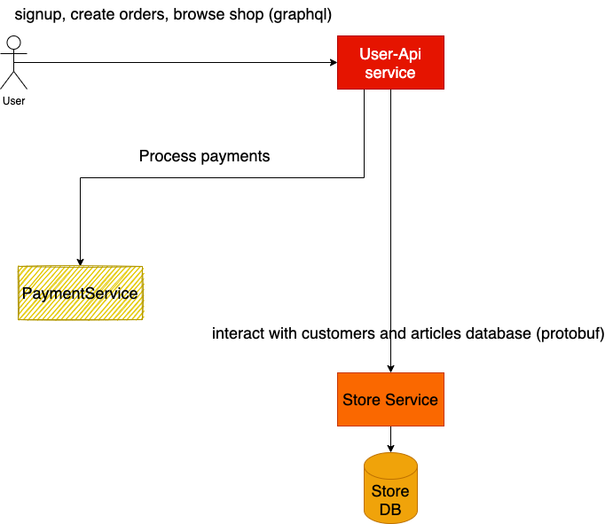
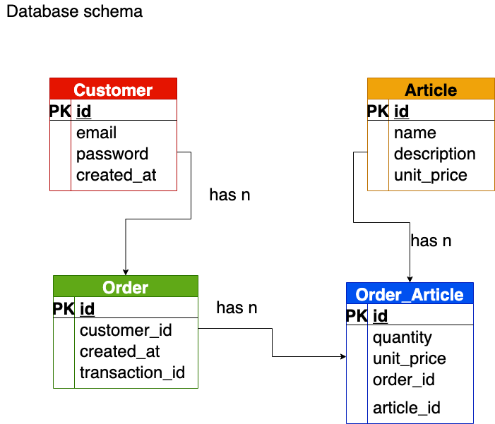

# Prima Rust Workshop 23

Developed by [veeso](https://github.com/veeso).

## Setup

### Start services

```sh
docker-compose build
docker-compose up -d
```

### Load fixtures

```sh
pip3 install requests psycopg2
./tools/generate-fixtures.py --customers 20 --orders-per-customer 3 --articles-per-order 3
```

---

## Schema

### System Architecture



### Store Database



---

## Test units

Requirements:

```sh
cargo install cargo-make sqlx-cli
```

Setup:

```sh
docker-compose -f docker-compose.dev.yml up -d
```

### Store

```sh
cd store/
cargo make --profile test test
```
